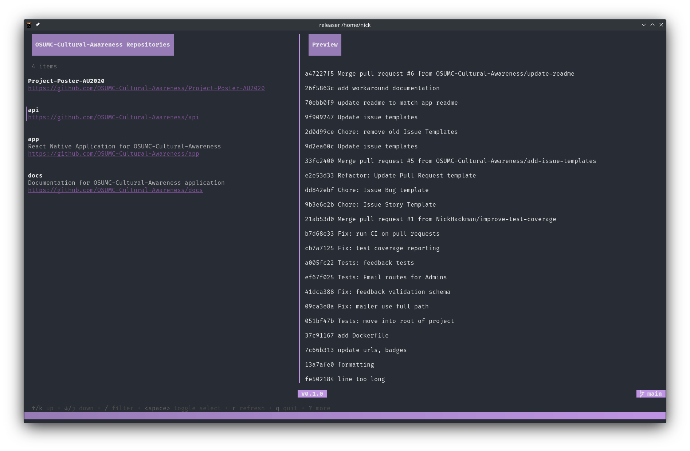

# Releaser

<p>
    <picture>
        
    </picture>
</p>

[](https://github.com/NickHackman/releaser/actions/workflows/build.yml)
[](https://github.com/NickHackman/releaser/actions/workflows/lint.yml)
[](https://github.com/NickHackman/releaser/actions/workflows/coverage.yml)

Create releases for a whole GitHub organization with ease!

## Objective

The purpose of this projects stems from working on Agile teams that have a quick release cycle (weekly, bi-weekly).
 In my experience these teams usually have one team member that wastes a day or so each cycle
 determining which of their 30+ GitHub repositories need to be released and writing up and releasing them.

Releaser automates the entire process!

## Install

Distributed through Go's easy way to install binaries!

```shell
go install github.com/NickHackman/releaser@latest
```

## How

1. Lists GitHub Organizations for the current user
2. Upon Org selection, goes through all repos and sees if any of them should be released

    - [X] Not Archived
    - [X] Not a Template
    - [X] New changes on provided branch (if not provided the default branch)

3. Uses [Go Templates](https://pkg.go.dev/text/template) + [Sprig](https://github.com/Masterminds/sprig)

    ```yaml
    {{ range .Commits }}
    {{ substr 0 8 .Sha }} {{ .Summary }}
    {{ end }}
    ```

4. Determines the version based off of the latest release (or defaults to `v0.1.0`)

5. Create the Releases

6. Prints out a Markdown list of the releases for posting in places like Slack for visibility :+1:

## Configuration

```yaml
# GitHub or GitHub Enterprise hostname
host: github.com

# How long to wait for GitHub prior to terminating execution
timeout: 1m0s

# Defaults to the provided branch, or the default branch if not provided
# Commented by default to use the Repository's default branch
#
# branch: main

# Organization to create releases for it will bypass UI page to pick an organization
# Commented by default
#
# org: Example

# Repositories to release, by providing this flag/config it will bypass the UI completely and create releases
# Commented by default
#
# repositories:
# - Example1
# - Example2

# Method to determine the new version.
#
# Methods:
# major        Increment Major version 1.3.0 -> 2.0.0
# minor        Increment Minor version 1.3.0 -> 1.4.0
# patch        Increment Patch version 1.3.0 -> 1.3.1
version:
  change: minor

# Template
#
# Top Level Variables:
# {{ .RepositoryName }}                  hello-world
# {{ .RepositoryOwner }}                 octocat
# {{ .RepositoryURL }}                   https://github.com/octocat/hello-world
# {{ .RepositoryDescription }}           Example description
# {{ .RepositoryDefaultBranch }}         main
# {{ .Commits }}                         List of commits
#
# Commit:
# {{ .Sha }}                             Unique identifier for commit
# {{ .URL }}                             URL to commit
# {{ .Summary }}                         First line of the commit message
# {{ .Message }}                         Full commit message (includes newlines)
#
# Author/Committer:
# {{ .AuthorUsername }}                  octocat (GitHub Username)
# {{ .AuthorName }}                      octocat (Commit Name)
# {{ .AuthorEmail }}                     octocat@github.com
# {{ .AuthorDate }}
# {{ .AuthorURL }}                       https://github.com/octocat
#
# Templates also include Sprig functions: https://masterminds.github.io/sprig/strings.html
#
# Example:
#
# {{ range .Commits }}
# {{ substr 0 8 .Sha }} committed by {{ .CommitterUsername }} and authored by {{ .AuthorUsername }} {{ .Summary }}
# {{ end }}
template: |
  {{ range .Commits }}
  {{ substr 0 8 .Sha }} {{ .Summary }}
  {{ end }}
```

## License

[MIT](./LICENSE)
